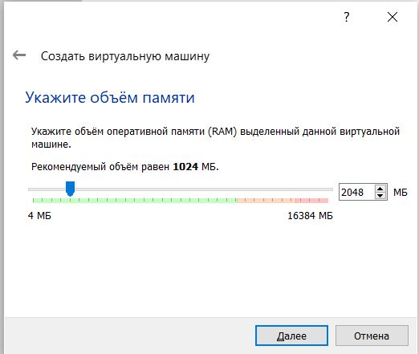

---
# Front matter
lang: ru-Ru
title: "Лабораторная работа №1"
subtitle: "Установка дистрибутива Rocky"
author: "Аль-Дорихим Рамзи"

# Formatting
toc-title: "Содержание"
toc: true # Table of contents
toc_depth: 2
lof: true # List of figures
lot: true # List of tables
fontsize: 12pt
linestretch: 1.5
papersize: a4paper
documentclass: scrreprt
polyglossia-lang: russian
polyglossia-otherlangs: english
mainfont: PT Serif
romanfont: PT Serif
sansfont: PT Sans
monofont: PT Mono
mainfontoptions: Ligatures=TeX
romanfontoptions: Ligatures=TeX
sansfontoptions: Ligatures=TeX,Scale=MatchLowercase
monofontoptions: Scale=MatchLowercase
indent: true
pdf-engine: xelatex
header-includes:
  - \linepenalty=10 # the penalty added to the badness of each line within a paragraph (no associated penalty node) Increasing the value makes tex try to have fewer lines in the paragraph.
  - \interlinepenalty=0 # value of the penalty (node) added after each line of a paragraph.
  - \hyphenpenalty=50 # the penalty for line breaking at an automatically inserted hyphen
  - \exhyphenpenalty=50 # the penalty for line breaking at an explicit hyphen
  - \binoppenalty=700 # the penalty for breaking a line at a binary operator
  - \relpenalty=500 # the penalty for breaking a line at a relation
  - \clubpenalty=150 # extra penalty for breaking after first line of a paragraph
  - \widowpenalty=150 # extra penalty for breaking before last line of a paragraph
  - \displaywidowpenalty=50 # extra penalty for breaking before last line before a display math
  - \brokenpenalty=100 # extra penalty for page breaking after a hyphenated line
  - \predisplaypenalty=10000 # penalty for breaking before a display
  - \postdisplaypenalty=0 # penalty for breaking after a display
  - \floatingpenalty = 20000 # penalty for splitting an insertion (can only be split footnote in standard LaTeX)
  - \raggedbottom # or \flushbottom
  - \usepackage{float} # keep figures where there are in the text
  - \floatplacement{figure}{H} # keep figures where there are in the text
---

# Цель работы

Приобретение практических навыков установки операционной системы Rocky Linux на виртуальную машину и настройка минимально необходимого окружения для дальнейшей работы.

# Задание

Установить дистрибутив Rocky Linux на виртуальную машину.

# Теоретическое введение

Для выполнения данной лабораторной нет специальной теории. Необходимы общие знания в области компьютерных наук.

# Выполнение лабораторной работы

Создаем виртуальную машину в VirtualBox. 

{#fig:001}

Указываем объем оперативной памяти, выделенный виртуальной машине.

{#fig:002}

Создаем новый динамический виртуальный жесткий диск типа VDI и задаем его размер.

{#fig:003}

{#fig:004}

{#fig:005}

{#fig:006}

В VirtualBox  добавляем новый привод оптических дисков, где выбираем заранее скачанный образ выбранной операционной системы.

{#fig:007}

После этого запускаем виртуальную машину и начинаем установку ОС.

{#fig:008}

По ходу начальной настройки ОС перед ее установкой нужно выполнить несколько шагов.

​	1. Выбрать язык

{#fig:009}

2) Настроить часовой пояс.

{#fig:010}

​	3. Выбрать пакет предустановленных программ.

{#fig:011}

4. Отключить KDUMP.

{#fig:011}

5. Включить сетевое соединение.

{#fig:012}

6. Установить пароль для root.

{#fig:013}

7. Создать пользователя с правами администратора.

{#fig:014}

8. Правильно перезагрузить систему.

{#fig:015}

После выполнения данных шагов мы попадаем на рабочий стол нашей виртуальной машины. 

{#fig:016}

Подключить образ диска дополнительной гостевой ОС.

{#fig:017}

Процесс подключения.

{#fig:018}

## Домашнее задание

Информация о системе:

{#fig:019}

По каким то причинам я не смог получить информацию о текущей тактовой частоте процессора и об доступной памяти.

# Выводы

В ходе выполнения данной лабораторной работы я приобрел  навыки установки операционной системы Rocky Linux на виртуальную машину.

# Список литературы

- <code>[Кулябов Д. С., Королькова А. В., Геворкян М. Н Лабораторная работа №1](https://esystem.rudn.ru/mod/folder/view.php?id=892013)</code>