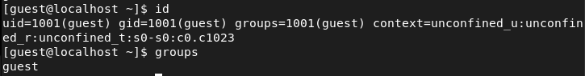
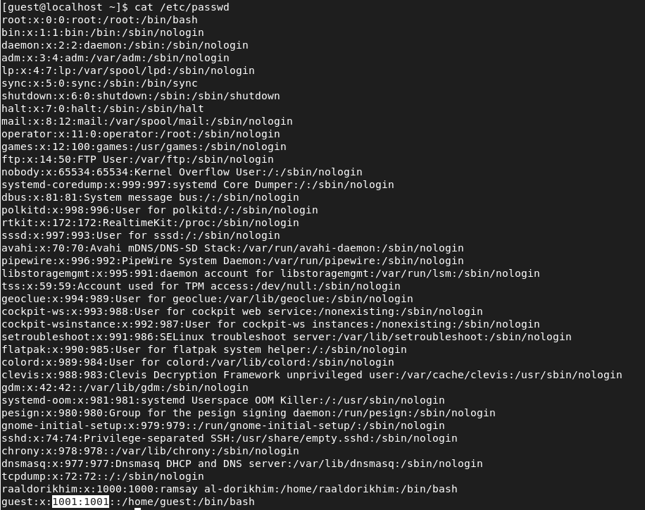
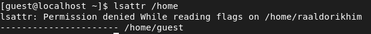
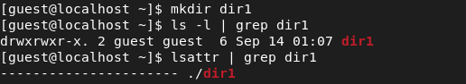
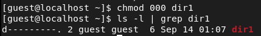

---
# Front matter
lang: ru-Ru
title: "Лабораторная работа №2"
subtitle: "Дискреционное разграничение прав в Linux. Основные атрибуты."
author: "Аль-Дорихим Рамзи"

# Formatting
toc-title: "Содержание"
toc: true # Table of contents
toc_depth: 2
lof: true # List of figures
lot: true # List of tables
fontsize: 12pt
linestretch: 1.5
papersize: a4paper
documentclass: scrreprt
polyglossia-lang: russian
polyglossia-otherlangs: english
mainfont: PT Serif
romanfont: PT Serif
sansfont: PT Sans
monofont: PT Mono
mainfontoptions: Ligatures=TeX
romanfontoptions: Ligatures=TeX
sansfontoptions: Ligatures=TeX,Scale=MatchLowercase
monofontoptions: Scale=MatchLowercase
indent: true
pdf-engine: xelatex
header-includes:
  - \linepenalty=10 # the penalty added to the badness of each line within a paragraph (no associated penalty node) Increasing the value makes tex try to have fewer lines in the paragraph.
  - \interlinepenalty=0 # value of the penalty (node) added after each line of a paragraph.
  - \hyphenpenalty=50 # the penalty for line breaking at an automatically inserted hyphen
  - \exhyphenpenalty=50 # the penalty for line breaking at an explicit hyphen
  - \binoppenalty=700 # the penalty for breaking a line at a binary operator
  - \relpenalty=500 # the penalty for breaking a line at a relation
  - \clubpenalty=150 # extra penalty for breaking after first line of a paragraph
  - \widowpenalty=150 # extra penalty for breaking before last line of a paragraph
  - \displaywidowpenalty=50 # extra penalty for breaking before last line before a display math
  - \brokenpenalty=100 # extra penalty for page breaking after a hyphenated line
  - \predisplaypenalty=10000 # penalty for breaking before a display
  - \postdisplaypenalty=0 # penalty for breaking after a display
  - \floatingpenalty = 20000 # penalty for splitting an insertion (can only be split footnote in standard LaTeX)
  - \raggedbottom # or \flushbottom
  - \usepackage{float} # keep figures where there are in the text
  - \floatplacement{figure}{H} # keep figures where there are in the text
---

# Цель работы

Получение практических навыков работы в консоли с атрибутами файлов, закрепление теоретических основ дискреционного разграничения доступа в современных системах с открытым кодом на базе ОС Linux.

# Выполнение лабораторной работы

1. В установленной при выполнении предыдущей лабораторной работы операционной системе создам учётную запись пользователя guest (использую учётную запись администратора): useradd guest.

   Получение прав администратора:
   
   {#fig:001}

​        Создание пользователя:

{#fig:002}

2. Задам пароль для пользователя guest (использую учётную запись администратора): passwd guest.

   {#fig:003}

3.  Войдите в систему от имени пользователя guest.

{#fig:004}

4. Определю директорию, в которой я нахожусь, командой pwd. 

   {#fig:005}

   Это домашняя директория.

5. Уточню имя моего пользователя командой whoami.

   {#fig:006}

6. Уточню имя моего пользователя, его группу, а также группы, куда входит пользователь, командой id. Выведенные значения uid, gid и др. запомним. Сравним вывод id с выводом команды groups.

   {#fig:007}

​		uid = 1001, gid = 1001.

​		Если сравнивать вывод id с выводом команды groups, то очевидно, что команда id выводит много больше информации.

7. Полученная информация об имени пользователя совпадает с данными, выводимыми в приглашении командной строки.

8. Просмотрим файл /etc/passwd командой cat /etc/passwd Найдем в нём свою учётную запись. Определим uid пользователя. Определим gid пользователя. Сравним найденные значения с полученными в предыдущих пунктах.

   {#fig:008}

​		uid = 1001 и gid = 1001, как и в предыдущих пунктах.

9. Определю существующие в системе директории командой ls -l /home/ . 

   {#fig:009}

​		  Мне удалось получить список поддиректорий директории /home. У пользователя, 	  	      		  создавшего директорию (raaldorikhim/guest) есть права на чтение (r), запись (w) и 			           		  выполнение (x)  файлов в директории. У остальных пользователей никаких прав нет.

10. Проверю, какие расширенные атрибуты установлены на поддиректориях, находящихся в директории /home, командой: lsattr /home.

    {#fig:010}

​		  Мне не удалось увидеть расширенные атрибуты как текущей директории, так и 		  	   	 	 директории  другого пользователя.

11. Создам в домашней директории поддиректорию dir1 командой mkdir dir1. Определим командами ls -l и lsattr, какие права доступа и расширенные атрибуты были выставлены на директорию dir1.

    {#fig:011}

    У всех есть права на чтение и выполнение, но только у создателя и группы создателя есть права на запись. Расширенные атрибуты просмотреть не удалось.

12. Сниму с директории dir1 все атрибуты командой chmod 000 dir1 и проверю с её помощью правильность выполнения команды ls -l.

    {#fig:012}

13. Попытаюсь создать в директории dir1 файл file1 командой echo "test" > /home/guest/dir1/file1.

    {#fig:013}

    Мне было отказано в создании файла в связи с тем, что ни у кого из пользователей нет прав на создание файла, это видно по скриншоту из предыдущего пункта. Проверю наличие файла file1 в директории dir1.

    {#fig:014}

​	 Поскольку права на просмотр директории закрыты, я не смог просмотреть файлы директории.

14. Заполню таблицу «Установленные права и разрешенные действия». 

    | **Права директории** | **Права файла** | **Создание файла** | **Удаление файла** | **Запись в файл** | **Чтение файла** | **Смена директории** | **Просмотр файлов в директории** | **Переименование файла** | **Смена атрибутов файла** |
    | -------------------- | --------------- | ------------------ | ------------------ | ----------------- | ---------------- | -------------------- | -------------------------------- | ------------------------ | ------------------------- |
    | d--------- (000)     | --------- (000) | -                  | -                  | -                 | -                | -                    | -                                | -                        | -                         |
    | d--x------ (100)     | --------- (000) | -                  | -                  | -                 | -                | +                    | -                                | -                        | +                         |
    | d-w------- (200)     | --------- (000) | -                  | -                  | -                 | -                | -                    | -                                | -                        | -                         |
    | d-wx------ (300)     | --------- (000) | +                  | +                  | -                 | -                | +                    | -                                | +                        | +                         |
    | dr-------- (400)     | --------- (000) | -                  | -                  | -                 | -                | -                    | +                                | -                        | -                         |
    | dr-x------ (500)     | --------- (000) | -                  | -                  | -                 | -                | +                    | +                                | -                        | +                         |
    | drw------- (600)     | --------- (000) | -                  | -                  | -                 | -                | -                    | +                                | -                        | -                         |
    | drwx------ (700)     | --------- (000) | +                  | +                  | -                 | -                | +                    | +                                | +                        | +                         |
    | d--------- (000)     | --x------ (100) | -                  | -                  | -                 | -                | -                    | -                                | -                        | -                         |
    | d--x------ (100)     | --x------ (100) | -                  | -                  | -                 | -                | +                    | -                                | -                        | +                         |
    | d-w------- (200)     | --x------ (100) | -                  | -                  | -                 | -                | -                    | -                                | -                        | -                         |
    | d-wx------ (300)     | --x------ (100) | +                  | +                  | -                 | -                | +                    | +                                | +                        | +                         |
    | dr-------- (400)     | --x------ (100) | +                  | -                  | +                 | +                | +                    | -                                | -                        | -                         |
    | dr-x------ (500)     | --x------ (100) | +                  | -                  | -                 | +                | +                    | +                                | +                        | +                         |
    | drw------- (600)     | --x------ (100) | -                  | -                  | -                 | +                | +                    | +                                | +                        | +                         |
    | drwx------ (700)     | --x------ (100) | -                  | -                  | -                 | -                | +                    | -                                | +                        | +                         |
    | d--------- (000)     | -w------- (200) | +                  | +                  | +                 | -                | +                    | +                                | +                        | +                         |
    | d--x------ (100)     | -w------- (200) | +                  | +                  | -                 | -                | +                    | +                                | +                        | +                         |
    | d-w------- (200)     | -w------- (200) | +                  | +                  | -                 | +                | -                    | +                                | +                        | +                         |
    | d-wx------ (300)     | -w------- (200) | -                  | -                  | -                 | -                | +                    | +                                | +                        | +                         |
    | dr-------- (400)     | -w------- (200) | +                  | +                  | +                 | +                | -                    | +                                | -                        | +                         |
    | dr-x------ (500)     | -w------- (200) | +                  | +                  | +                 | -                | +                    | +                                | +                        | +                         |
    | drw------- (600)     | -w------- (200) | +                  | +                  | -                 | +                | -                    | +                                | -                        | +                         |
    | drwx------ (700)     | -w------- (200) | -                  | +                  | +                 | -                | +                    | -                                | +                        | -                         |
    | d--------- (000)     | -wx------ (300) | +                  | +                  | +                 | +                | -                    | -                                | -                        | +                         |
    | d--x------ (100)     | -wx------ (300) | -                  | +                  | -                 | +                | +                    | -                                | +                        | -                         |
    | d-w------- (200)     | -wx------ (300) | +                  | +                  | +                 | +                | +                    | -                                | +                        | +                         |
    | d-wx------ (300)     | -wx------ (300) | -                  | +                  | -                 | +                | -                    | -                                | -                        | -                         |
    | dr-------- (400)     | -wx------ (300) | +                  | -                  | +                 | +                | +                    | +                                | +                        | -                         |
    | dr-x------ (500)     | -wx------ (300) | +                  | -                  | +                 | -                | -                    | +                                | +                        | -                         |
    | drw------- (600)     | -wx------ (300) | +                  | +                  | -                 | +                | +                    | +                                | +                        | +                         |
    | drwx------ (700)     | -wx------ (300) | +                  | +                  | -                 | +                | -                    | +                                | +                        | -                         |
    | d--------- (000)     | r-------- (400) | -                  | -                  | -                 | +                | -                    | +                                | +                        | +                         |
    | d--x------ (100)     | r-------- (400) | +                  | +                  | -                 | -                | -                    | +                                | +                        | -                         |
    | d-w------- (200)     | r-------- (400) | -                  | +                  | +                 | +                | +                    | -                                | +                        | +                         |
    | d-wx------ (300)     | r-------- (400) | +                  | -                  | +                 | +                | -                    | -                                | +                        | -                         |
    | dr-------- (400)     | r-------- (400) | -                  | -                  | +                 | -                | +                    | -                                | +                        | +                         |
    | dr-x------ (500)     | r-------- (400) | +                  | +                  | +                 | +                | +                    | -                                | +                        | -                         |
    | drw------- (600)     | r-------- (400) | +                  | +                  | -                 | -                | +                    | -                                | +                        | -                         |
    | drwx------ (700)     | r-------- (400) | -                  | +                  | +                 | +                | -                    | -                                | +                        | +                         |
    | d--------- (000)     | r-x------ (500) | -                  | -                  | -                 | +                | +                    | -                                | +                        | -                         |
    | d--x------ (100)     | r-x------ (500) | -                  | -                  | -                 | -                | -                    | +                                | +                        | +                         |
    | d-w------- (200)     | r-x------ (500) | -                  | -                  | +                 | -                | -                    | +                                | -                        | -                         |
    | d-wx------ (300)     | r-x------ (500) | -                  | -                  | +                 | +                | -                    | +                                | -                        | +                         |
    | dr-------- (400)     | r-x------ (500) | +                  | -                  | +                 | -                | -                    | -                                | -                        | -                         |
    | dr-x------ (500)     | r-x------ (500) | -                  | +                  | +                 | +                | +                    | -                                | +                        | +                         |
    | drw------- (600)     | r-x------ (500) | -                  | -                  | +                 | -                | +                    | +                                | -                        | -                         |
    | drwx------ (700)     | r-x------ (500) | -                  | +                  | -                 | +                | +                    | -                                | +                        | +                         |
    | d--------- (000)     | rw------- (600) | -                  | -                  | +                 | -                | -                    | +                                | -                        | +                         |
    | d--x------ (100)     | rw------- (600) | +                  | +                  | +                 | +                | -                    | -                                | -                        | +                         |
    | d-w------- (200)     | rw------- (600) | -                  | -                  | -                 | -                | -                    | +                                | -                        | -                         |
    | d-wx------ (300)     | rw------- (600) | +                  | +                  | -                 | +                | -                    | -                                | -                        | +                         |
    | dr-------- (400)     | rw------- (600) | -                  | -                  | -                 | -                | -                    | +                                | +                        | -                         |
    | dr-x------ (500)     | rw------- (600) | +                  | +                  | +                 | +                | -                    | -                                | +                        | +                         |
    | drw------- (600)     | rw------- (600) | -                  | -                  | +                 | +                | -                    | +                                | +                        | -                         |
    | drwx------ (700)     | rw------- (600) | +                  | +                  | +                 | +                | -                    | -                                | +                        | +                         |
    | d--------- (000)     | rwx------ (700) | -                  | -                  | +                 | +                | -                    | +                                | +                        | -                         |
    | d--x------ (100)     | rwx------ (700) | +                  | +                  | +                 | +                | -                    | -                                | -                        | +                         |
    | d-w------- (200)     | rwx------ (700) | +                  | +                  | +                 | -                | -                    | +                                | -                        | -                         |
    | d-wx------ (300)     | rwx------ (700) | +                  | +                  | -                 | -                | -                    | +                                | -                        | +                         |
    | dr-------- (400)     | rwx------ (700) | +                  | -                  | -                 | -                | -                    | -                                | -                        | -                         |
    | dr-x------ (500)     | rwx------ (700) | +                  | -                  | +                 | -                | -                    | -                                | -                        | +                         |
    | drw------- (600)     | rwx------ (700) | -                  | +                  | -                 | -                | -                    | +                                | -                        | -                         |
    | drwx------ (700)     | rwx------ (700) | +                  | +                  | -                 | -                | -                    | -                                | -                        | +                         |

    

15. Заполню таблицу «Минимальные права для совершения операций».

    | Операция               | Минимальные права на директорию | Минимальные права на файл |
    | ---------------------- | ------------------------------- | ------------------------- |
    | Создание файла         | d-wx------ (300)                | --------- (000)           |
    | Удаление файла         | d-wx------ (300)                | --------- (000)           |
    | Чтение файла           | d--x------ (100)                | r-------- (400)           |
    | Запись в файл          | d--x------ (100)                | -w------- (200)           |
    | Переименование файла   | d-wx------ (300)                | --------- (000)           |
    | Создание поддиректории | d-wx------ (300)                | --------- (000)           |
    | Удаление поддиректории | d-wx------ (300)                | --------- (000)           |

### Вывод

В ходе данной лабораторной работы мы получили практические навыки работы в консоли с атрибутами файлов, закрепили теоретические основы разграничения доступа на базе ОС Linux.

# Список литературы

- <code>[Кулябов Д. С., Королькова А. В., Геворкян М. Н Лабораторная работа №2](https://esystem.rudn.ru/pluginfile.php/1651747/mod_resource/content/6/002-lab_discret_attr.pdf)</code>