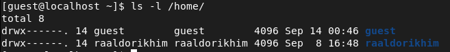
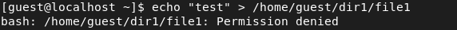

# Лабораторная работа №2
## Ramzi A. Al-Dorikhim
### RUDN University, 2022 Moscow, Russia

---
<!--_class: titleslide2 -->
#### Цель выполнения лабораторной работы
Получение практических навыков работы в консоли с атрибутами файлов, закрепление теоретических основ дискреционного разграничения доступа в современных системах с открытым кодом на базе ОС Linux.

---
<!--_class: titleslide2 -->
#### Существующие директории
# 

---
<!--_class: titleslide2 -->
#### Попытка создания файла
# 

---
<!--_class: titleslide2 -->
##### Минимальные права для совершения операций
| Операция               | Мин. права на дир. | Мин. права на файл |
| ---------------------- | ------------------------------- | ------------------------- |
| Создание файла         | d-wx------ (300)                | --------- (000)           |
| Удаление файла         | d-wx------ (300)                | --------- (000)           |
| Чтение файла           | d--x------ (100)                | r-------- (400)           |
| Запись в файл          | d--x------ (100)                | -w------- (200)           |
| Переименование файла   | d-wx------ (300)                | --------- (000)           |
| Создание поддиректории | d-wx------ (300)                | --------- (000)           |
| Удаление поддиректории | d-wx------ (300)                | --------- (000)           |

---

<!--_class: titleslide2 -->
#### Вывод

В ходе данной лабораторной работы мы получили практические навыки работы в консоли с атрибутами файлов, закрепили теоретические основы разграничения доступа на базе ОС Linux.

---
# Спасибо за внимание
