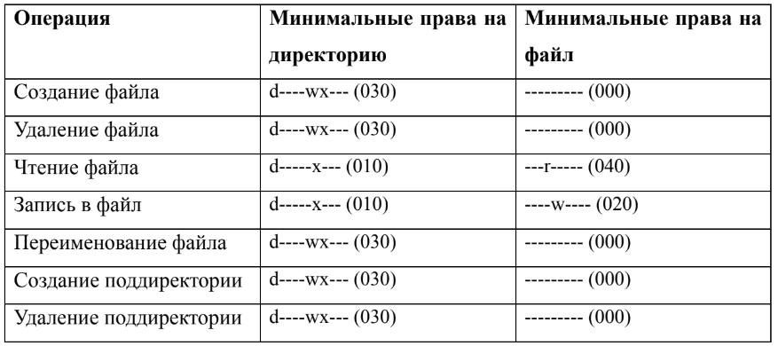

---
# Front matter
lang: ru-Ru
title: "Лабораторная работа №3"
subtitle: "Дискреционное разграничение прав в Linux. Два пользователя"
author: "Аль-Дорихим Рамзи"

# Formatting
toc-title: "Содержание"
toc: true # Table of contents
toc_depth: 2
lof: true # List of figures
lot: true # List of tables
fontsize: 12pt
linestretch: 1.5
papersize: a4paper
documentclass: scrreprt
polyglossia-lang: russian
polyglossia-otherlangs: english
mainfont: PT Serif
romanfont: PT Serif
sansfont: PT Sans
monofont: PT Mono
mainfontoptions: Ligatures=TeX
romanfontoptions: Ligatures=TeX
sansfontoptions: Ligatures=TeX,Scale=MatchLowercase
monofontoptions: Scale=MatchLowercase
indent: true
pdf-engine: xelatex
header-includes:
  - \linepenalty=10 # the penalty added to the badness of each line within a paragraph (no associated penalty node) Increasing the value makes tex try to have fewer lines in the paragraph.
  - \interlinepenalty=0 # value of the penalty (node) added after each line of a paragraph.
  - \hyphenpenalty=50 # the penalty for line breaking at an automatically inserted hyphen
  - \exhyphenpenalty=50 # the penalty for line breaking at an explicit hyphen
  - \binoppenalty=700 # the penalty for breaking a line at a binary operator
  - \relpenalty=500 # the penalty for breaking a line at a relation
  - \clubpenalty=150 # extra penalty for breaking after first line of a paragraph
  - \widowpenalty=150 # extra penalty for breaking before last line of a paragraph
  - \displaywidowpenalty=50 # extra penalty for breaking before last line before a display math
  - \brokenpenalty=100 # extra penalty for page breaking after a hyphenated line
  - \predisplaypenalty=10000 # penalty for breaking before a display
  - \postdisplaypenalty=0 # penalty for breaking after a display
  - \floatingpenalty = 20000 # penalty for splitting an insertion (can only be split footnote in standard LaTeX)
  - \raggedbottom # or \flushbottom
  - \usepackage{float} # keep figures where there are in the text
  - \floatplacement{figure}{H} # keep figures where there are in the text
---

# Цель работы

Получение практических навыков работы в консоли с атрибутами файлов для групп пользователей.

# Выполнение лабораторной работы

1. В установленной при выполнении предыдущей лабораторной работы операционной системе создам учётную запись пользователя guest (использую учётную запись администратора).

1. Задам пароль для пользователя guest (использую учётную запись администратора): passwd guest.

   Пользователь создан в прошлой лабораторной работе.
   
   {#fig:001}

​       

3. Аналогично создам второго пользователя guest2.

{#fig:002}

4. Добавим пользователя guest2 в группу guest: gpasswd -a guest2 guest

   {#fig:003}

5. Осуществите вход в систему от двух пользователей на двух разных консолях: guest на первой консоли и guest2 на второй консоли. 

   {#fig:004}

6. Для обоих пользователей командой pwd определите директорию, в которой вы находитесь. Сравните её с приглашениями командной строки. 

   {#fig:005}

   {#fig:006}

7. Уточните имя вашего пользователя, его группу, кто входит в неё и к каким группам принадлежит он сам. Определите командами groups guest и groups guest2, в какие группы входят пользователи guest и guest2. Сравните вывод команды groups с выводом команд id -Gn и id -G. 

   {#fig:007}

   {#fig:008}

   {#fig:009}

   {#fig:010}

   Сравню вывод команды groups с выводом команд id -Gn и id -G.
   Первая команда выводит на экран группы пользователя, но без уточнения к
   какому пользователю относятся группы, т.к. команды работаю только для
   пользователя, через которого открыта консоль. Вторая команда выводи код группы
   пользователя.

   {#fig:011}

   {#fig:012}

   

8. Сравните полученную информацию с содержимым файла /etc/group. Просмотрите файл командой cat /etc/group.

   Для guest:

   {#fig:013}

   {#fig:014}

   {#fig:015}

   Для guest2:

   {#fig:016}

   {#fig:017}

   {#fig:018}

9. От имени пользователя guest2 выполните регистрацию пользователя guest2 в группе guest командой newgrp guest. 

   {#fig:019}

10. От имени пользователя guest измените права директории /home/guest, разрешив все действия для пользователей группы: chmod g+rwx /home/guest.

     {#fig:020}

11. От имени пользователя guest снимите с директории /home/guest/dir1 все атрибуты командой chmod 000 dirl и проверьте правильность снятия атрибутов. 

    {#fig:021}

12. Меняя атрибуты у директории dir1 и файла file1 от имени пользователя guest и делая проверку от пользователя guest2, заполните табл. 3.1, определив опытным путём, какие операции разрешены, а какие нет. Для этого создам скрипты и перенесу их директории guest и guest2.

{#fig:022}

Полученная таблица не совпадает с таблицей из прошлой
лабораторной работы, поскольку члены группы не имеют права изменять
атрибуты файла. Для остальных операций члену группы нужны такие же
права, как у владельца.

{#fig:023}

{#fig:024}

{#fig:025}

{#fig:026}

{#fig:027}

{#fig:028}

На основании заполненной таблицы выше определю те или иные минимально
необходимые права для выполнения пользователем guest2 операций внутри
директории dir1 и заполню таблицу:

{#fig:029}

### Вывод

В ходе данной лабораторной работы мы получили практические навыки работы в консоли с атрибутами файлов для групп пользователей.

# Список литературы

- <code>[Кулябов Д. С., Королькова А. В., Геворкян М. Н Лабораторная работа №3](https://esystem.rudn.ru/pluginfile.php/1651749/mod_resource/content/4/003-lab_discret_2users.pdf)</code>