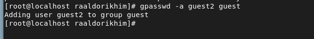
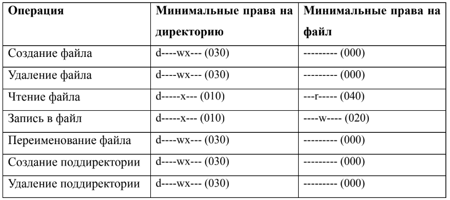

# Лабораторная работа №3
## Ramzi A. Al-Dorikhim
### RUDN University, 2022 Moscow, Russia

---
<!--_class: titleslide2 -->
#### Цель выполнения лабораторной работы
Получение практических навыков работы в консоли с атрибутами файлов для групп пользователей.

---
<!--_class: titleslide2 -->
#### Объединение в группы
# 

---
<!--_class: titleslide2 -->
# Операция внутри dir: права
# 

---

<!--_class: titleslide2 -->
#### Вывод

В ходе данной лабораторной работы мы получили практические навыки работы в консоли с атрибутами файлов для групп пользователей.

---
# Спасибо за внимание
