---
# Front matter
lang: ru-Ru
title: "Лабораторная работа №4"
subtitle: "Дискреционное разграничение прав в Linux. Расширенные атрибуты"
author: "Аль-Дорихим Рамзи"

# Formatting
toc-title: "Содержание"
toc: true # Table of contents
toc_depth: 2
lof: true # List of figures
lot: true # List of tables
fontsize: 12pt
linestretch: 1.5
papersize: a4paper
documentclass: scrreprt
polyglossia-lang: russian
polyglossia-otherlangs: english
mainfont: PT Serif
romanfont: PT Serif
sansfont: PT Sans
monofont: PT Mono
mainfontoptions: Ligatures=TeX
romanfontoptions: Ligatures=TeX
sansfontoptions: Ligatures=TeX,Scale=MatchLowercase
monofontoptions: Scale=MatchLowercase
indent: true
pdf-engine: xelatex
header-includes:
  - \linepenalty=10 # the penalty added to the badness of each line within a paragraph (no associated penalty node) Increasing the value makes tex try to have fewer lines in the paragraph.
  - \interlinepenalty=0 # value of the penalty (node) added after each line of a paragraph.
  - \hyphenpenalty=50 # the penalty for line breaking at an automatically inserted hyphen
  - \exhyphenpenalty=50 # the penalty for line breaking at an explicit hyphen
  - \binoppenalty=700 # the penalty for breaking a line at a binary operator
  - \relpenalty=500 # the penalty for breaking a line at a relation
  - \clubpenalty=150 # extra penalty for breaking after first line of a paragraph
  - \widowpenalty=150 # extra penalty for breaking before last line of a paragraph
  - \displaywidowpenalty=50 # extra penalty for breaking before last line before a display math
  - \brokenpenalty=100 # extra penalty for page breaking after a hyphenated line
  - \predisplaypenalty=10000 # penalty for breaking before a display
  - \postdisplaypenalty=0 # penalty for breaking after a display
  - \floatingpenalty = 20000 # penalty for splitting an insertion (can only be split footnote in standard LaTeX)
  - \raggedbottom # or \flushbottom
  - \usepackage{float} # keep figures where there are in the text
  - \floatplacement{figure}{H} # keep figures where there are in the text
---

# Цель работы

Получение практических навыков работы в консоли с расширенными атрибутами файлов.

# Выполнение лабораторной работы

1. От имени пользователя guest определите расширенные атрибуты файла /home/guest/dir1/file1 командой lsattr /home/guest/dir1/file1.

   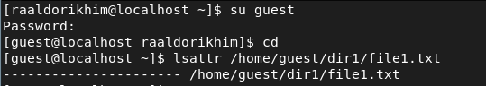{#fig:001}

2. Установите командой chmod 600 file1 на файл file1 права, разрешающие чтение и запись для владельца файла. 

   {#fig:002}

   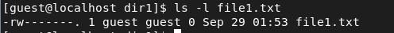{#fig:003}

3. Попробуйте установить на файл /home/guest/dir1/file1 расширенный атрибут a от имени пользователя guest: chattr +a /home/guest/dir1/file1 В ответ вы должны получить отказ от выполнения операции. 

   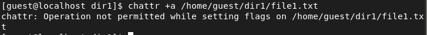{#fig:004}

4. Зайдите на вторую консоль с правами администратора либо повысьте свои права с помощью команды su. Попробуйте установить расширенный атрибут a на файл /home/guest/dir1/file1 от имени суперпользователя: chattr +a /home/guest/dir1/file1.

   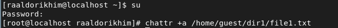{#fig:005}

5. От пользователя guest проверьте правильность установления атрибута: lsattr /home/guest/dir1/file1.

   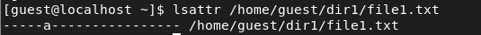{#fig:006}

6. Выполните дозапись в файл file1 слова «test» командой echo "test" /home/guest/dir1/file1 После этого выполните чтение файла file1 командой cat /home/guest/dir1/file1 Убедитесь, что слово test было успешно записано в file1. 

   {#fig:007}

   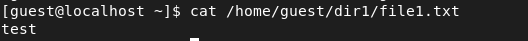{#fig:008}

   

7. Попробуйте удалить файл file1 либо стереть имеющуюся в нём информацию командой echo "abcd" > /home/guest/dirl/file1. Попробуйте переименовать файл. 

​	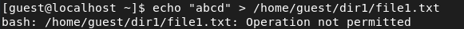{#fig:009}

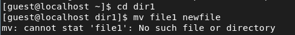{#fig:010}

8. Попробуйте с помощью команды chmod 000 file1 установить на файл file1 права, например, запрещающие чтение и запись для владельца файла. Удалось ли вам успешно выполнить указанные команды? 

​	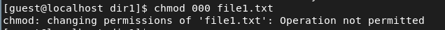{#fig:011}

​        Не удалось.

9. Снимите расширенный атрибут a с файла /home/guest/dirl/file1 от имени суперпользователя командой chattr -a /home/guest/dir1/file1 Повторите операции, которые вам ранее не удавалось выполнить. Ваши наблюдения занесите в отчёт. 

​		{#fig:012}

​		Повторим операции:

​        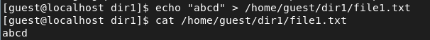{#fig:013}

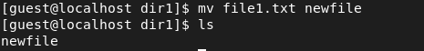{#fig:014}

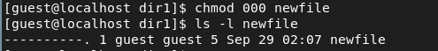{#fig:015}

​		Таким образом, можно сделать вывод, что атрибут «а» позволяет добавлять
​		информацию в файл, но удалять ее, переименовывать файл или менять права доступа
​		к нему нельзя. Атрибут может быть установлен только суперпользователем.

10. Повторите ваши действия по шагам, заменив атрибут «a» атрибутом «i». Удалось ли вам дозаписать информацию в файл? Ваши наблюдения занесите в отчёт.

    Предварительно обратно переименую файл и установлю полные права.

​		{#fig:016}

{#fig:017}

Попробую установить на файл /home/guest/dir1/file1 расширенный атрибут «i»
от имени пользователя guest: chattr +i /home/guest/dir1/file1

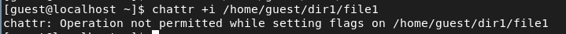{#fig:018}

Получен отказ.

Зайду на вторую консоль с правами администратора и попробую установить расширенный атрибут «i» на файл /home/guest/dir1/file1 от имени суперпользователя: chattr +i /home/guest/dir1/file1

{#fig:019}

От пользователя guest проверю правильность установления атрибута: lsattr
/home/guest/dir1/file1

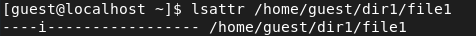{#fig:020}

Выполню дозапись в файл file1 слова «test» командой echo "test" >>
/home/guest/dir1/file1

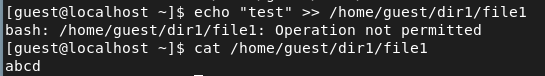{#fig:021}

Не получилось.

Попробую стереть имеющуюся в нём информацию и внести новую командой
echo "test" > /home/guest/dirl/file1

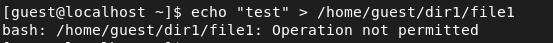{#fig:022}

Попробую переименовать файл

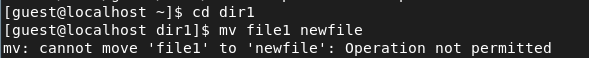{#fig:022}

Попробую с помощью команды chmod 000 file1 установить на файл file1 права,
например, запрещающие чтение и запись для владельца файла.

{#fig:022}

Не удалось.

Сниму расширенный атрибут «i» с файла /home/guest/dirl/file1 от имени
суперпользователя командой chattr -i /home/guest/dir1/file1

{#fig:022}

Повторю операции, которые мне ранее не удавалось выполнить.

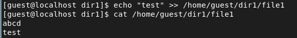{#fig:022}

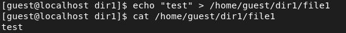{#fig:022}

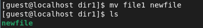{#fig:022}

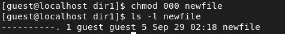{#fig:022}

Таким образом, можно сделать вывод, что атрибут «i» указывает на то, что
нельзя изменять название файла, его содержимое и права доступа. Установить
атрибут может только суперпользователь.

### Вывод

В ходе данной лабораторной работы мы получили практические навыки работы в консоли с атрибутами файлов для групп пользователей.

# Список литературы

- <code>[Кулябов Д. С., Королькова А. В., Геворкян М. Н Лабораторная работа №4](https://esystem.rudn.ru/pluginfile.php/1651751/mod_resource/content/3/004-lab_discret_extattr.pdf)</code>