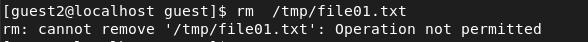

---
# Front matter
lang: ru-Ru
title: "Лабораторная работа №5"
subtitle: "Дискреционное разграничение прав в Linux. Исследование влияния дополнительных атрибутов"
author: "Аль-Дорихим Рамзи"

# Formatting
toc-title: "Содержание"
toc: true # Table of contents
toc_depth: 2
lof: true # List of figures
lot: true # List of tables
fontsize: 12pt
linestretch: 1.5
papersize: a4paper
documentclass: scrreprt
polyglossia-lang: russian
polyglossia-otherlangs: english
mainfont: PT Serif
romanfont: PT Serif
sansfont: PT Sans
monofont: PT Mono
mainfontoptions: Ligatures=TeX
romanfontoptions: Ligatures=TeX
sansfontoptions: Ligatures=TeX,Scale=MatchLowercase
monofontoptions: Scale=MatchLowercase
indent: true
pdf-engine: xelatex
header-includes:
  - \linepenalty=10 # the penalty added to the badness of each line within a paragraph (no associated penalty node) Increasing the value makes tex try to have fewer lines in the paragraph.
  - \interlinepenalty=0 # value of the penalty (node) added after each line of a paragraph.
  - \hyphenpenalty=50 # the penalty for line breaking at an automatically inserted hyphen
  - \exhyphenpenalty=50 # the penalty for line breaking at an explicit hyphen
  - \binoppenalty=700 # the penalty for breaking a line at a binary operator
  - \relpenalty=500 # the penalty for breaking a line at a relation
  - \clubpenalty=150 # extra penalty for breaking after first line of a paragraph
  - \widowpenalty=150 # extra penalty for breaking before last line of a paragraph
  - \displaywidowpenalty=50 # extra penalty for breaking before last line before a display math
  - \brokenpenalty=100 # extra penalty for page breaking after a hyphenated line
  - \predisplaypenalty=10000 # penalty for breaking before a display
  - \postdisplaypenalty=0 # penalty for breaking after a display
  - \floatingpenalty = 20000 # penalty for splitting an insertion (can only be split footnote in standard LaTeX)
  - \raggedbottom # or \flushbottom
  - \usepackage{float} # keep figures where there are in the text
  - \floatplacement{figure}{H} # keep figures where there are in the text
---

# Цель работы

Изучение механизмов изменения идентификаторов, применения SetUID- и Sticky-битов. Получение практических навыков работы в консоли с дополнительными атрибутами. Рассмотрение работы механизма смены идентификатора процессов пользователей, а также влияние бита Sticky на запись и удаление файлов.

# Выполнение лабораторной работы

Проверю, установлен ли у меня компилятор gcc командой gcc –v. 

{#fig:001}

##### Создание программы

Войду в систему от имени пользователя guest.

{#fig:002}

Создам программу simpleid.c.

{#fig:003}

Скомпилирую программу командой gcc simpleid.c -o simpleid и удостоверюсь, что
файл программы создан

{#fig:004}

Выполню программу simpleid командой ./simpleid

{#fig:005}

Выполню системную программу id командой id. Результат совпадает.

{#fig:006}

Усложню программу, добавив вывод действительных идентификаторов. Создам
новый файл simpleid2.c

{#fig:007}

Скомпилирую и запущу simpleid2.c

{#fig:008}

##### Работа с е SetUID-битом

От имени суперпользователя выполню команды:
chown root:guest /home/guest/simpleid2
chmod u+s /home/guest/simpleid2

{#fig:009}

{#fig:010}

Команда chown root:guest /home/guest/simpleid2 меняет владельца файла. Команда
chmod u+s /home/guest/simpleid2 меняет права доступа к файлу.

Проверю правильность установки новых атрибутов и смены владельца файла
simpleid2 командой: ls -l simpleid2

{#fig:011}

Запущу simpleid2 и id, команды: ./simpleid2 и id

{#fig:012}

После выполнения команд изменился параметр e_uid.

##### SetGID-бит

От имени суперпользователя выполню команды:
chmod u-s /home/guest/simpleid2 – чтобы отменить изменения на прошлом шаге
chmod g+s /home/guest/simpleid2

{#fig:013}

Проверю правильность установки новых атрибутов и смены владельца файла
simpleid2 командой: ls -l simpleid2

{#fig:014}

Запущу simpleid2 и id, команды: ./simpleid2 и id. Ничего не изменилось.

{#fig:015}

Создам программу readfile.c

{#fig:016}

Скомпилирую её командой: gcc readfile.c -o readfile

{#fig:017}

Сменю владельца у файла readfile.c и изменю права так, чтобы только
суперпользователь (root) мог прочитать его, a guest не мог.

{#fig:018}

Проверю, что пользователь guest не может прочитать файл readfile.c.

{#fig:019}

Сменю у программы readfile владельца и установлю SetUID-бит.

{#fig:020}

Проверю, может ли программа readfile прочитать файл readfile.c

{#fig:021}

Проверю, может ли программа readfile прочитать файл /etc/shadow

{#fig:022}

{#fig:023}

Поскольку у программы установлен SetUID-бит, то ей временно предоставляются
права владельца файла (суперпользователя). Поэтому программа может прочитать
файл с правами доступа только для владельца суперпользователя.

##### Исследование Sticky-бита

Выясню, установлен ли атрибут Sticky на директории /tmp, для чего выполню
команду ls -l / | grep tmp

{#fig:024}

От имени пользователя guest создам файл file01.txt в директории /tmp со словом test:
echo "test" > /tmp/file01.txt

{#fig:025}

Просмотрю атрибуты у только что созданного файла и разрешу чтение и запись для
категории пользователей «все остальные»:
ls -l /tmp/file01.txt
chmod o+rw /tmp/file01.txt
ls -l /tmp/file01.txt

{#fig:026}

От пользователя guest2 (не являющегося владельцем) попробую прочитать файл
/tmp/file01.txt: cat /tmp/file01.txt

{#fig:027}

От пользователя guest2 попробую дозаписать в файл /tmp/file01.txt слово test2
командой echo "test2" >> /tmp/file01.txt

{#fig:028}

Мне удалось выполнить операцию.

Проверю содержимое файла командой cat /tmp/file01.txt

{#fig:029}

От пользователя guest2 попробую записать в файл /tmp/file01.txt слово test3, стерев
при этом всю имеющуюся в файле информацию командой echo "test3" >
/tmp/file01.txt

{#fig:030}

Мне удалось выполнить операцию.

Проверю содержимое файла командой cat /tmp/file01.txt

{#fig:031}

От пользователя guest2 попробую удалить файл /tmp/file01.txt командой rm
/tmp/file01.txt

{#fig:032}

Мне не удалось удалить файл.

Повышу свои права до суперпользователя следующей командой su и выполню после
этого команду, снимающую атрибут t (Sticky-бит) с директории /tmp: chmod -t /tmp

{#fig:033}

Покину режим суперпользователя командой exit

{#fig:034}

От пользователя guest2 проверьте, что атрибута t у директории /tmp нет: ls -l / | grep
tmp

{#fig:035}

Повторю предыдущие шаги.

{#fig:036}

Мне удалось удалить файл от имени пользователя, не являющегося его владельцем.
Это связано с тем, что Sticky-bit позволяет защищать файлы от случайного удаления,
когда несколько пользователей имеют права на запись в один и тот же каталог. Если

у файла атрибут t стоит, значит пользователь может удалить файл, только если он
является пользователем-владельцем файла или каталога, в котором содержится файл.
Если же этот атрибут не установлен, то удалить файл могут все пользователи,
которым позволено удалять файлы из каталога.

Повышу свои права до суперпользователя и верну атрибут t на директорию /tmp:
su
chmod +t /tmp
exit

{#fig:037}

### Вывод

В ходе данной лабораторной работы я изучила механизмы изменения
идентификаторов, применения SetUID-, SetGID- и Sticky-битов. Рассмотрела работу
механизма смены идентификатора процессов пользователей, а также влияние бита
Sticky на запись и удаление файлов.

# Список литературы

- <code>[Кулябов Д. С., Королькова А. В., Геворкян М. Н Лабораторная работа №5](https://esystem.rudn.ru/pluginfile.php/1651751/mod_resource/content/3/004-lab_discret_extattr.pdf)</code>