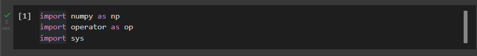
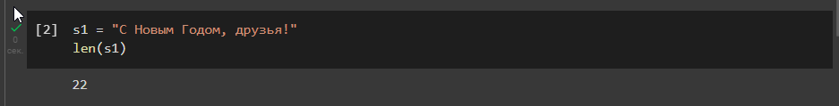
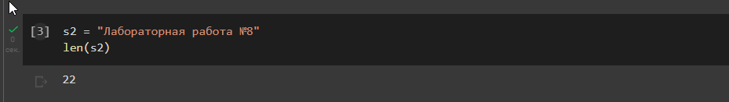
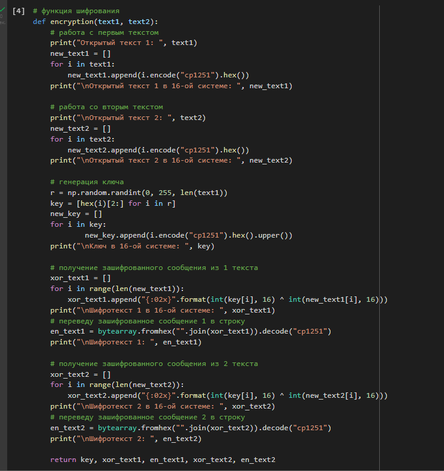
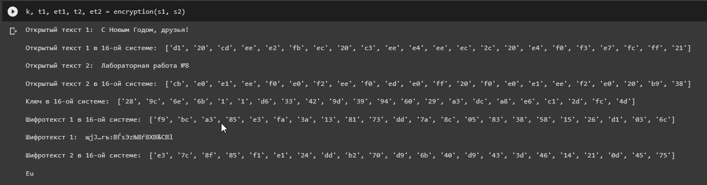
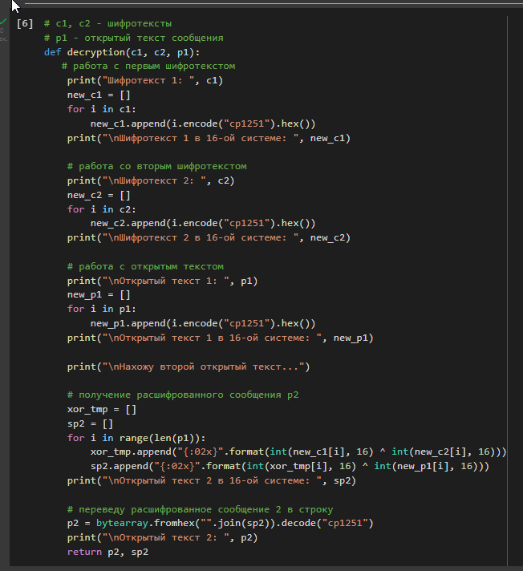
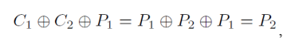
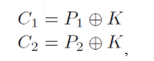

---
# Front matter
lang: ru-Ru
title: "Лабораторная работа №8"
subtitle: "Элементы криптографии. Шифрование (кодирование) различных исходных текстов одним ключом"
author: "Аль-Дорихим Рамзи"

# Formatting
toc-title: "Содержание"
toc: true # Table of contents
toc_depth: 2
lof: true # List of figures
lot: true # List of tables
fontsize: 12pt
linestretch: 1.5
papersize: a4paper
documentclass: scrreprt
polyglossia-lang: russian
polyglossia-otherlangs: english
mainfont: PT Serif
romanfont: PT Serif
sansfont: PT Sans
monofont: PT Mono
mainfontoptions: Ligatures=TeX
romanfontoptions: Ligatures=TeX
sansfontoptions: Ligatures=TeX,Scale=MatchLowercase
monofontoptions: Scale=MatchLowercase
indent: true
pdf-engine: xelatex
header-includes:
  - \linepenalty=10 # the penalty added to the badness of each line within a paragraph (no associated penalty node) Increasing the value makes tex try to have fewer lines in the paragraph.
  - \interlinepenalty=0 # value of the penalty (node) added after each line of a paragraph.
  - \hyphenpenalty=50 # the penalty for line breaking at an automatically inserted hyphen
  - \exhyphenpenalty=50 # the penalty for line breaking at an explicit hyphen
  - \binoppenalty=700 # the penalty for breaking a line at a binary operator
  - \relpenalty=500 # the penalty for breaking a line at a relation
  - \clubpenalty=150 # extra penalty for breaking after first line of a paragraph
  - \widowpenalty=150 # extra penalty for breaking before last line of a paragraph
  - \displaywidowpenalty=50 # extra penalty for breaking before last line before a display math
  - \brokenpenalty=100 # extra penalty for page breaking after a hyphenated line
  - \predisplaypenalty=10000 # penalty for breaking before a display
  - \postdisplaypenalty=0 # penalty for breaking after a display
  - \floatingpenalty = 20000 # penalty for splitting an insertion (can only be split footnote in standard LaTeX)
  - \raggedbottom # or \flushbottom
  - \usepackage{float} # keep figures where there are in the text
  - \floatplacement{figure}{H} # keep figures where there are in the text
---

# Цель работы

Освоить на практике применение режима однократного гаммирования на
примере кодирования различных исходных текстов одним ключом.

# Выполнение лабораторной работы

Импортирую библиотеки:

{#fig:001}

Подаю на вход 2 строки:

{#fig:002}

{#fig:003}

1. Напишу функцию, определяющую вид шифротекстов C1 и C2 обеих строк при известном ключе. Функция получает на вход две символьные строки, которые затем переводятся
   в 16-ую систему. Далее генерируется рандомный ключ, при помощи которого
   определяются соответствующие шифротексты в 16-й системе. Зачем шифротекст
   переводится в строковый формат. Функция возвращает ключ, оба шифротекста в 16-
   ой системе и строковом формате.

{#fig:004}

Результат работы функции:

{#fig:005}

2. Напишу функцию, которая при известных двух шифротекстах и одном
   открытом тексте находит вид второго открытого текста без ключа.
   Функция получает на вход два шифротекста и один открытый в строковом
   формате, затем переводит их в 16-ю систему. Затем применяя принцип однократного
   гаммирования, находит вид второго открытого сообщения без использования ключа
   шифрования. Возвращает функция второе расшифрованное сообщение в строковом
   формате и 16-ой системе.

   {#fig:006}

   Результат работы функции:

   {#fig:007}

### Ответы на контрольные вопросы

1. Как, зная один из текстов (P1 или P2), определить другой, не зная при этом ключа?
  Для этого надо воспользоваться формулой:

  {#fig:008}

где С1 и С2 – шифротексты. Как видно, ключ в данной формуле не
используется.
2. Что будет при повторном использовании ключа при шифровании текста?
  В таком случае мы получим исходное сообщение.

3. Как реализуется режим шифрования однократного гаммирования одним ключом
  двух открытых текстов?
  Он реализуется по следующей формуле:

  {#fig:009}

​		где Сi – шифротексты, Pi – открытые тексты, K – единый ключ шифрования.
4. Перечислите недостатки шифрования одним ключом двух открытых текстов.
Во-первых, имея на руках одно из сообщений в открытом виде и оба
шифротекста, злоумышленник способен расшифровать каждое сообщение, не
зная ключа.
Во-вторых, зная шаблон сообщений, злоумышленник получает возможность
определить те символы сообщения P2, которые находятся на позициях
известного шаблона сообщения P1. В соответствии с логикой сообщения P2,
злоумышленник имеет реальный шанс узнать ещё некоторое количество

​		символов сообщения P2. Таким образом, применяя формулу из п. 1, с
​		подстановкой вместо P1 полученных на предыдущем шаге новых символов
​		сообщения P2 злоумышленник если не прочитает оба сообщения, то
​		значительно уменьшит пространство их поиска.
​		Наконец, зная ключ, злоумышленник смоет расшифровать все сообщения,
​		которые были закодированы при его помощи.

5. Перечислите преимущества шифрования одним ключом двух открытых текстов.
Такой подход помогает упростить процесс шифрования и дешифровки. Также,
при отправке сообщений между 2-я компьютерами, удобнее пользоваться
одним общим ключом для передаваемых данных.

### Вывод

В ходе данной лабораторной работы я освоила применение режима
однократного гаммирования на примере кодирования различных исходных текстов
одним ключом.

# Список литературы

- <code>[Кулябов Д. С., Королькова А. В., Геворкян М. Н Лабораторная работа №8](https://esystem.rudn.ru/pluginfile.php/1651751/mod_resource/content/3/004-lab_discret_extattr.pdf)</code>