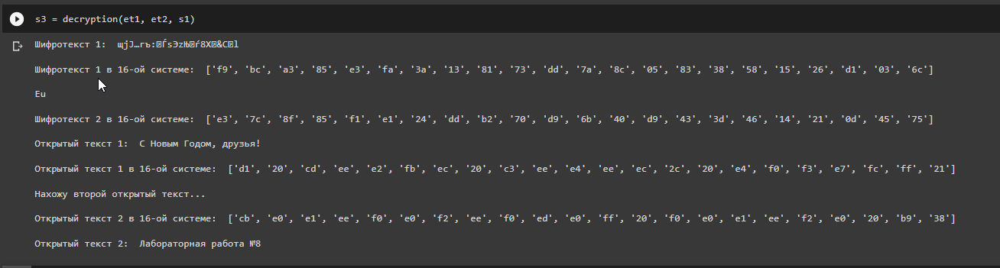

# Лабораторная работа №8
## Ramzi A. Al-Dorikhim
### RUDN University, 2022 Moscow, Russia

---
<!--_class: titleslide2 -->
#### Цель выполнения лабораторной работы
Освоить на практике применение режима однократного гаммирования на
примере кодирования различных исходных текстов одним ключом.

---
<!--_class: titleslide1 -->
#### Результат работы шифрователя

---

<!--_class: titleslide1 -->
#### Результат работы дешифрователя

---

<!--_class: titleslide1 -->
#### Вывод

В ходе данной лабораторной работы я освоила применение режима
однократного гаммирования на примере кодирования различных исходных текстов
одним ключом.

---
# Спасибо за внимание
